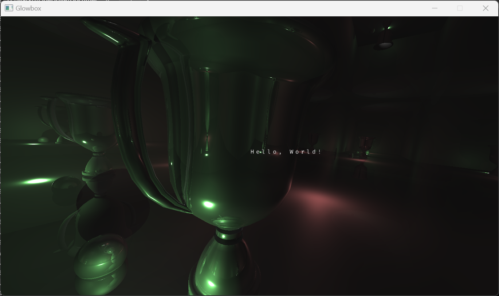
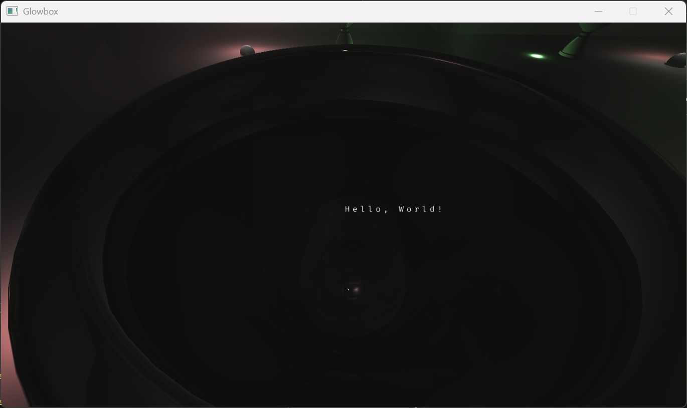

# Computer Graphics 2 Project (TDT4230)

This repository contains the final project for the **Graphics & Visualization** (Computer Graphics 2) course at NTNU (spring 2025).

The goal of this project was to implement ray traced reflections and shadows using OpenGL Compute Shaders. The project was inspired by the new Indiana Jones game, specifically to observe ray traced self reflections on a trophy as seen in the game.

[](https://github.com/Marko19907/Computer-graphics-2-project/actions/workflows/build.yml)

## Screenshots

<p align="center">
  
  
</p>

<p align="center">
  
  
</p>


## Features

* [x] Ray traced reflections and shadows, 1 primary ray + 2 secondary bounces (configurable)
* [x] Shadows via shadow rays toward every light
* [x] Toggleable ray tracing on/off
* [x] Toggleable trophy as a stress‑test
* [x] Fixed camera and free camera modes
* [x] Import and render any model in OBJ format

## Controls

* `R` - Toggle ray tracing on/off
* `T` - Toggle trophy on/off
	* The trophy has a lot of triangles so it might be slow to render, recommended to hide it for better performance.
* `C` - Toggle between fixed camera and free camera (WASD + arrow keys)
* `ESC` - Exit the application

## Usage

The project requires a GPU that supports OpenGL 4.3 or higher, there's no need for a GPU that supports hardware ray tracing

### GitHub Releases [Recommended]

You can download the latest release [GitHub Releases](https://github.com/Marko19907/Computer-graphics-2-project/releases) 
This is the preferred way to get a stable build.

### GitHub Actions

You can also build the project using GitHub Actions. The workflow will build the project and upload an executable as a GitHub Artifact.

### Building from Source

You can build the project from source too. The project uses CMake for building, to build and run the project, follow these steps:

1. Clone the repository and initialize submodules in the current directory:
   ```bash
   git clone --recursive git@github.com:Marko19907/Computer-graphics-2-project.git .
   ```
2. In the project directory, use CMake to generate the build files:
   ```bash
   cmake -B build
   ```
3. Then build the project:
   ```bash
   cmake --build build
   ```

## Limitations

* The ray tracing is not optimized for performance, it is a basic implementation.
	* There's no acceleration structure, every ray is tested against every triangle in the scene.
	* No hardware ray tracing is used, only compute shaders.
* Hard shadows only, no soft shadows.
* No textures in the ray traced path, only solid colors.

